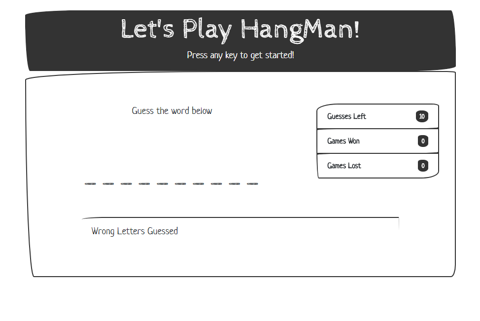

# HangMan

### Classic Hangman game - Programming Version

* Press any key to get started!

* Wins: (# of times you guessed the word correctly).

* If the word is `javascript`, it will be displayed like this when the game starts: `_ _ _ _ _ _ _ _ _ _`.

* As the you guess the correct letters, they will be revealed: `j a v a _  _  _  _  p t`.

* Number of Guesses Remaining: (# of guesses you have reaming).

* Letters Already Guessed: (Letters you have already guessed, displayed like `L Z Y H`).

* After you win/lose .. the game should automatically choose another word for you to guess.

## GitHub Repo: https://lponder82.github.io/Hangman-Game/

## Screenshot

## Languages/Libraries used:

* Javascript

